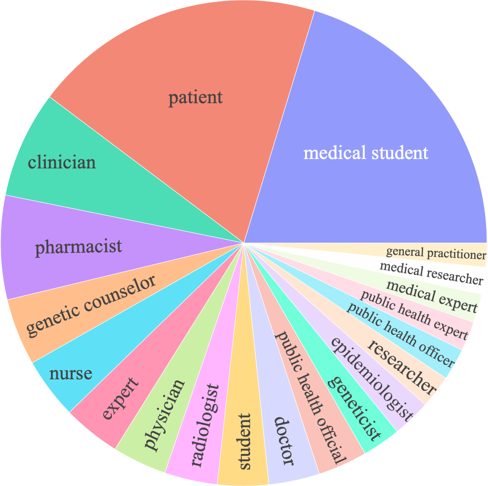

<p align="center" width="100%">
    
</p>


# AlpaCare: Instruction-tuned Large Language Models for Medical Applications

This is the repo for *AlpaCare*, which are LLMs tuned on medical instructions. The repo contains:

- The 52K medical instruction-response dataset, *MedInstruct-52k* used for fine-tuning *AlpaCare*.
- A 217 clinical craft free-form instruction evaluation test set,*MedInstruct-test*.
- The weights of AlpaCare models (7B and 13B on LLaMA and LLaMA-2, respectively.)
- The code for:
    1. medical task generation;
    2. fine-tuning LLaMA series models;
    3. fine-tuned model response generation;
    4. response evaluation via LLMs.

## Overview
*AlpaCare* models contain 4 models (7B/13B - LLaMA[1]/LLaMA-2[2]) tuned on a 52k medical instruction-following dataset *MedInstruct-52k*, following Alpaca[3] and Self-Instruct[4]. 

To set up conda enviroment for data generation/model training, please do:

```bash
pip install -r requirements.txt
```


[1]: LLaMA: Open and Efficient Foundation Language Models. Hugo Touvron, Thibaut Lavril, Gautier Izacard, Xavier Martinet, Marie-Anne Lachaux, Timothée Lacroix, Baptiste Rozière, Naman Goyal, Eric Hambro, Faisal Azhar, Aurelien Rodriguez, Armand Joulin, Edouard Grave, Guillaume Lample. https://arxiv.org/abs/2302.13971v1 

[2] Llama 2: Open foundation and fine-tuned chat models. Hugo Touvron, Louis Martin, Kevin Stone, Peter Albert, Amjad Almahairi, Yasmine Babaei, Nikolay Bashlykov, Soumya Batra, Prajjwal Bhargava, Shruti Bhosale, Dan Bikel, Lukas Blecher, Cristian Canton Ferrer, Moya Chen, Guillem Cucurull, David Esiobu, Jude Fernandes, Jeremy Fu, Wenyin Fu, Brian Fuller, Cynthia Gao, Vedanuj Goswami, Naman Goyal, Anthony Hartshorn, Saghar Hosseini, Rui Hou, Hakan Inan, Marcin Kardas, Viktor Kerkez, Madian Khabsa, Isabel Kloumann, Artem Korenev, Punit Singh Koura, Marie-Anne Lachaux, Thibaut Lavril, Jenya Lee, Diana Liskovich, Yinghai Lu, Yuning Mao, Xavier Martinet, Todor Mihaylov, Pushkar Mishra, Igor Molybog, Yixin Nie, Andrew Poulton, Jeremy Reizenstein, Rashi Rungta, Kalyan Saladi, Alan Schelten, Ruan Silva, Eric Michael Smith, Ranjan Subramanian, Xiaoqing Ellen Tan, Binh Tang, Ross Taylor, Adina Williams, Jian Xiang Kuan, Puxin Xu, Zheng Yan, Iliyan Zarov, Yuchen Zhang, Angela Fan, Melanie Kambadur, Sharan Narang, Aurelien Rodriguez, Robert Stojnic, Sergey Edunov, and Thomas Scialom. https://arxiv.org/abs/2307.09288

[3]: Stanford Alpaca: An Instruction-following LLaMA Model.Rohan Taori and Ishaan Gulrajani and Tianyi Zhang and Yann Dubois and Xuechen Li and Carlos Guestrin and Percy Liang and Tatsunori B. Hashimoto. https://crfm.stanford.edu/2023/03/13/alpaca.html

[4]: Self-Instruct: Aligning Language Model with Self Generated Instructions. Yizhong Wang, Yeganeh Kordi, Swaroop Mishra, Alisa Liu, Noah A. Smith, Daniel Khashabi, Hannaneh Hajishirzi. https://arxiv.org/abs/2212.10560


## Data release
[*MedInstruct*](https://huggingface.co/datasets/xz97/MedInstruct) contains:
- MedInstruct datasets:
    1. *MedInstruct-52K*: 52 medical instruction-following data we used for fine-tuning *AlpaCare* models
    2. *MedInstruct-test*: 217 clinican craft free-form instruction evulation tasks with reference responses generated by `gpt-4`, `gpt-tubro-3.5`, `text-davinci-003` and `claude-2`.
           
    All files is a list of dictionaries in JSON/JSONL format, each dictionary contains the following fields:
    - `instruction`: `str`, the medical task the model should perform. Each of instrcutions in *MedInstruct-52K* and *MedInstruct-test* is unique. The instrcutions in *MedInstruct-52K* are generated by OpenAI `gpt-4`, while *MedInstruct-test* are clinian-craft.
    - `input`: `str`, optional medical context or example for the task to further explain the instruction and increase the task diversity.
    - `output`: `str`, the answer to the instruction as generated by `text-davinci-003`.
    - `difficulity`: `str`,  medical knolwedge difficulty level scale from 1-5 evulated by clinicans. This only appear in *MedInstruct-test*.

- Instrcutions: 
    1. All medical instrcutions generated by OpenAI `gpt-4` with/without filtering.
 

## Data Generation Process

We following the data generation pipeline from [self-instruct](https://github.com/yizhongw/self-instruct) and [Alpaca](https://crfm.stanford.edu/2023/03/13/alpaca.html), and modified several points:
*Instructions*:
  - Beginning with a medical task seed set that contains 167 clinical-craft clinical tasks.
  - Utilizing the GPT-4 engine for instruction data generation.
  - Crafting a [prompt](https://github.com/XZhang97666/AlpaCare/blob/master/prompt/instruction_prompt.txt) to serve as the medical instruction generation guidelines for GPT-4.
  - To reduce costs in task generation and introduce greater randomness, 12 instructions are generated at once. This is followed by the selection of 3 random seed instructions from the seed set.
  
*Responses*:
  - The GPT-3.5-turbo engine is used to synthesize responses, processing each instruction individually.
  
Here's an illustration of an instruction-response pair:

```
{
instruction: "Rewrite this instruction on how to use an inhaler to be more patient-friendly and less technical."
input: "Exhale deeply, engage mouthpiece of inhaler, depress canister while simultaneously inhaling long and deep, hold the breath for ten seconds, then gently exhale"
output: "Here's a more patient-friendly version of the instruction on how to use an inhaler:
1. Take a deep breath and completely breathe out. 
2. Put the mouthpiece of the inhaler into your mouth and seal your lips around it properly.
3. Press down the canister while breathing in slowly and deeply at the same time. 
4. Hold your breath for ten seconds. 5. Finally, breathe out gently."
}
```


In instruction data analysis, we demonstrate the diversity of the *MedInstruct-52K* in terms of:

(a) **Instruction Language**: The inner circle displays the 20 most frequent root verbs, while the outer circle showcases the top 4 associated noun objects from the generated instructions. Although there is a wide range, only 22\% of the instructions are covered, as others do not adhere to the verb-noun format.

<p align="center">
  
</p>

(b) **View**: The top 20 frequent views from various medical personnel constitute 55\% of *MedInstruct-52K*.

<p align="center">
  
</p>

(c) **Task Types** The top 20 covered in *MedInstruct-52K*. Existing medical instruction-tuned models only focus on question-answering and doctor-patient conversation tasks.


<p align="center">
  
</p>


## Fine-tuning AlpaCare

We follows [Alpaca](https://crfm.stanford.edu/2023/03/13/alpaca.html) prompt to fine-tune LLaMA serises models and use standard Hugging Face training code.

For the instruction-finetuning of LLaMA/LLaMA-7B:
```
sh training/train_7b.sh
```
For the instruction-finetuning of LLaMA/LLaMA-13B:
```
sh training/train_13b.sh
```


